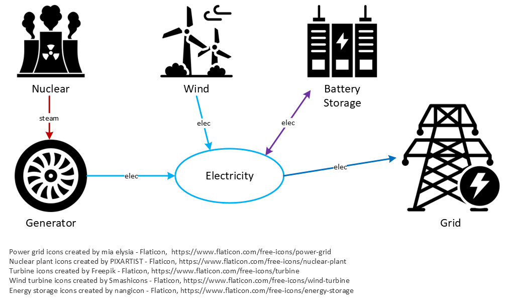

# Dispatch Optimization Variable Engine (DOVE)
[](https://github.com/idaholab/DOVE/actions/workflows/run-tests.yml)

DOVE is a python library developed at Idaho National Laboratory that performs dispatch optimization for energy systems. Dispatch in this context refers to the time-dependent activity levels of components in an energy system, bounded by constraints such as component capacities or resource conversion ratios. Within these constraints, DOVE applies user-provided economic data to generate an optimally profitable dispatch solution for the system. Especially well-suited for integrated energy system analysis, DOVE is equipped to handle a system involving an arbitrary number of resources with any number of respective resource markets. Its design prioritizes ease of use, and it features intuitive syntax and a pythonic structure while maintaining the flexibility to handle complex scenarios.

# Installation

Regardless of the installation method you select, you must ensure that you have the necessary solver(s) installed on your system in order to use DOVE. DOVE uses Pyomo for optimization and supports any solver supported by your Pyomo version.

## Install from Source
If you would like to contribute to DOVE, please refer to the [Developer Reference](https://idaholab.github.io/DOVE/references/developer.html) documentation page. If you are not interested in contributing, these instructions are sufficient.

First, ensure that the necessary prerequisites are installed on your system:
- **Python 3.11+** ([Download Python](https://www.python.org/downloads/))
- **Git** ([Download Git](https://git-scm.com/downloads))
- **uv** ([Install uv](https://docs.astral.sh/uv/getting-started/installation/))

Now navigate into the desired folder and clone the repository from github:
```
mkdir projects
cd projects
git clone https://github.com/idaholab/DOVE.git
```

Next, the project can be installed using pip:
```
pip install DOVE
```

# Quick-Start
DOVE contains three main types of objects: Resources, Components, and Systems.
- **Resources** refer to quantities that can be produced, consumed, converterted, and stored. Examples are electricity, heat, hydrogen, etc.
- **Components** are objects that perform actions on resources. Four types of Components are available in DOVE. Sources produce a specified resource; Sinks consume a specified resource; Converters change one or more resource into one or more other resources; and Storage components store resources across multiple timesteps.
- **Systems** each contain a set of Resources and a set of Components and are responsible for solving the optimization problem. Systems also take an argument to specify the time window over which the optimization should run. Usually only one system is created for each dispatch problem.

Consider a simple energy system with a nuclear power plant and generator, wind turbines, and battery storage, connected to a grid. The resource flow for this system is shown below:



Dispatch for this system can be economically optimized using DOVE in a python script:

```
import dove.core as dc

steam = dc.Resource(name="steam")
elec = dc.Resource(name="electricity")

nuclear = dc.Source(name="nuclear", produces=steam, installed_capacity=3)
gen = dc.Converter(
    name="generator",
    consumes=[steam],
    produces=[elec],
    capacity_resource=elec,
    installed_capacity=3,
    transfer_fn=dc.RatioTransfer(input_resources={steam: 1.0}, output_resources={elec: 1.0}),
)
wind = dc.Source(name="wind", produces=elec, installed_capacity=2, capacity_factor=[0.5, 1.0])
battery = dc.Storage(name="battery", resource=elec, installed_capacity=1, rte=0.9)
grid = dc.Sink(
    name="grid",
    consumes=elec,
    demand_profile=[3, 6],
    cashflows=[dc.Revenue(name="elec_sales", alpha=1.0)],
)

sys = dc.System(
    components=[nuclear, gen, wind, battery, grid], resources=[steam, elec], dispatch_window=[0, 1]
)
results = sys.solve("price_taker")
print(results)
with open("simple_demo.csv", "w") as f:
    f.write(results.to_csv())
```
This script will print the dispatch results as well as writing them to a csv file called "simple_demo.csv":
```
>>> python examples/simple_demonstration.py
   nuclear_steam_produces  generator_electricity_produces  ...  net_cashflow  objective
0                     3.0                             3.0  ...           3.0        8.9
1                     3.0                             3.0  ...           5.9        8.9

[2 rows x 10 columns]
```

Here are the formatted results from this script:

|    |   nuclear_steam_produces |   generator_electricity_produces |   generator_steam_consumes |   wind_electricity_produces |   battery_SOC |   battery_charge |   battery_discharge |   grid_electricity_consumes |   net_cashflow |   objective |
|-------------:|-------------------------:|---------------------------------:|---------------------------:|----------------------------:|--------------:|-----------------:|--------------------:|----------------------------:|---------------:|------------:|
|            0 |                        3 |                                3 |                         -3 |                           1 |      0.948683 |                1 |                 0   |                        -3   |              3 |         8.9 |
|            1 |                        3 |                                3 |                         -3 |                           2 |      0        |                0 |                 0.9 |                        -5.9 |            5.9 |         8.9 |

For additional examples, please see the [Examples](https://idaholab.github.io/DOVE/user-guide/examples.html) documentation page.

# Developers
Before installing DOVE, developers must install the following prerequisites in addition to those listed in the [Install from Source](#install-from-source) section:
- **pre-commit** (Framework for managing Git hooks)
- **An IDE or text editor** with Python support (e.g., VSCode, PyCharm)

Some tools frequently used by developers include:
- **Git** (for a variety of applications related to source control)
- **uv** (for environment and dependency management)
- **pytest** (for writing and running tests)
- **ruff** (for linting and formatting)
- **commitizen** (for versioning and standardized commits)

More extensive reference information for developers can be found on the [Developer Reference](https://idaholab.github.io/DOVE/references/developer.html) documentation page.
